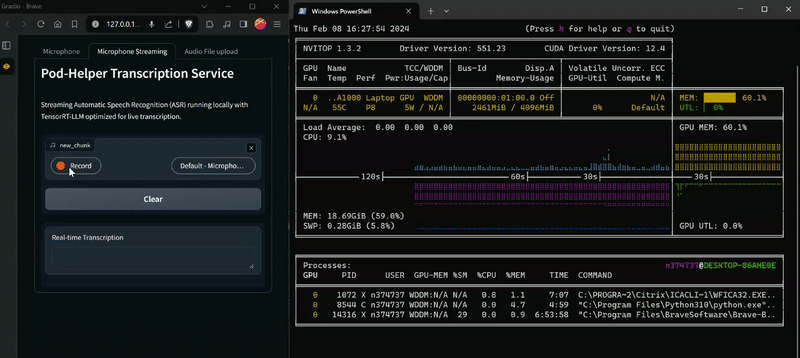

# 🎧 Pod-Helper


Pod-Helper is an advanced audio processing tool that goes beyond transcribing at lightning speed. It also offers audio repair capabilities using the MLM (Masked Language Model) objective to ensure your content maintains its quality and vibe.

## Features:
- ⚡ Real-time audio transcription with TRT-LLM optimized Whisper model.
- 🛠️ Audio corruption repair via good old Roberta.
- ✨ Sentiment analysis to gauge the mood of the content.

See demo of real-time ASR running **locally** on consumer hardware with only **2.5GB** of VRAM, or [click here](https://www.loom.com/share/db0338dc36e6434d9d924875d07296a1) to watch the video.



## How to use:

### Installation

```bash
# Clone the repository
git clone
cd pod-helper
```

### Prerequisites

- Install TensorRT-LLM for Windows from [tensorrt-llm-windows](https://github.com/NVIDIA/TensorRT-LLM/tree/rel/windows), after that.

```bash
# Install requirements
pip install -r requirements.txt
```

### Usage

Below we show to run main model behind this project [whisper model](https://github.com/openai/whisper/tree/main) in TensorRT-LLM on a single GPU, note that you can also run it on multiple GPUs but you need to rebuild the engine with the correct flags for that. See [Optional: Re-Build TensorRT engine(s)](#optional-re-build-tensorrt-engines) section for more details.

```bash
# Launch the Gradio interface
python3 app.py
```

### Overview

Pod-Helper utilizes the TensorRT-LLM Whisper example code, primarily from [`examples/whisper`](https://github.com/NVIDIA/TensorRT-LLM/tree/rel/examples/whisper). 

Key components include:
- [`run.py`](./run.py): Performs inference on WAV file(s) using the built TensorRT engines.
- [`app.py`](./app.py): Provides a Gradio interface for microphone input or file upload, utilizing `run.py` modules.

## <a id="optional-re-build-tensorrt-engines"></a>Optional: Re-Build TensorRT engine(s)

<details>
<summary>Click to expand</summary>

You can either use the pre-converted models located in the [`tinyrt`](https://github.com/Muhtasham/pod-helper/tree/master/tinyrt) folder or download the Whisper checkpoint models from [here](https://github.com/openai/whisper/blob/main/whisper/__init__.py#L27-L28).

```bash
wget --directory-prefix=assets https://raw.githubusercontent.com/openai/whisper/main/whisper/assets/multilingual.tiktoken
wget --directory-prefix=assets assets/mel_filters.npz https://raw.githubusercontent.com/openai/whisper/main/whisper/assets/mel_filters.npz
wget --directory-prefix=assets https://raw.githubusercontent.com/yuekaizhang/Triton-ASR-Client/main/datasets/mini_en/wav/1221-135766-0002.wav
# tiny model
wget --directory-prefix=assets https://openaipublic.azureedge.net/main/whisper/models/65147644a518d12f04e32d6f3b26facc3f8dd46e5390956a9424a650c0ce22b9/tiny.pt
```

TensorRT-LLM Whisper builds TensorRT engine(s) from the pytorch checkpoint, and saves the engine(s) to the specified directory. Skip this step if you are using the pre-converted models.

```bash
# install requirements first
pip install -r requirements.txt

# Build the tiny model using a single GPU with plugins.
python3 build.py --output_dir tinyrt --use_gpt_attention_plugin --use_gemm_plugin --use_layernorm_plugin  --use_bert_attention_plugin

# Build the tiny model using a single GPU with plugins without layernorm
python3 build.py --output_dir tinyrt_no_layernorm --use_gpt_attention_plugin --use_gemm_plugin  --use_bert_attention_plugin

# Build the tiny model using a single GPU with quantization
python3 build.py --output_dir tinyrt_weight_only --use_gpt_attention_plugin --use_gemm_plugin --use_bert_attention_plugin --use_weight_only
```
</details>

## Gen AI on RTX PCs Developer Contest Entry details

This project is a submission for the NVIDIA RTX PCs Developer Contest, under the General Generative AI Projects category. Pod-Helper showcases the potential of generative AI in transforming audio content creation and processing.

Category: [General Generative AI Projects category](https://www.nvidia.com/en-us/ai-data-science/generative-ai/rtx-developer-contest)


**Tested on following system:**
- Operating System: *Windows 10*
  - Version: 22H2 
  - OS Build: 19045.3930
- TensorRT-LLM version: 0.7.1
  - CUDA version: 12.4
  - cuDNN version: 8.9.7.29 
  - GPU: *NVIDIA RTX A1000*
  - Driver version: 551.23
  - DataType: FP16
  - Python version: 3.10.11
  - PyTorch version: 2.1.0+cu121

<blockquote class="twitter-tweet"><p lang="en" dir="ltr">Great to see the entries coming in for our <a href="https://twitter.com/hashtag/DevContest?src=hash&amp;ref_src=twsrc%5Etfw">#DevContest</a>. <br>Thank you <a href="https://twitter.com/Muhtasham9?ref_src=twsrc%5Etfw">@Muhtasham9</a> for this cool demo. <a href="https://t.co/6uvKC5NXwO">https://t.co/6uvKC5NXwO</a></p>&mdash; NVIDIA AI Developer (@NVIDIAAIDev) <a href="https://twitter.com/NVIDIAAIDev/status/1755991455716589971?ref_src=twsrc%5Etfw">February 9, 2024</a></blockquote>

## ToDos:
- [X]  Add support for real-time Automatic Speech Recognition (ASR).
- [X]  Add support for more audio formats, install ffmpeg.
- [ ]  Port BERT model for MLM and Sentiment Analysis to TensorRT-LLM, to support real-time audio repair and sentiment analysis. Waiting for this issue to be resolved: [BERT model for MLM and Sentiment Analysis](https://github.com/NVIDIA/TensorRT-LLM/issues/1042)
- [ ]  Add support for more audio repair capabilities.
- [ ]  Add support for more languages.

## Contributing

Contributions to enhance and expand this project are welcome. Please see the `CONTRIBUTING.md` file for guidelines on how to contribute.

## License

This project is licensed under the [MIT License](LICENSE).
