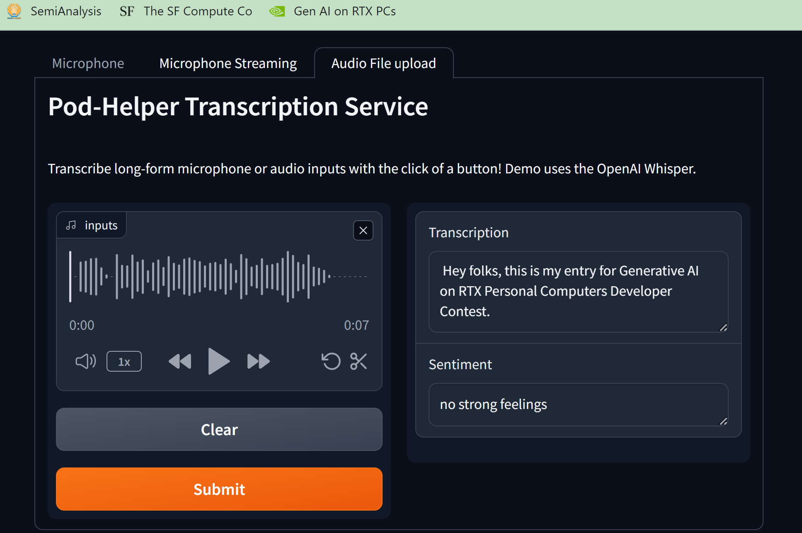

# 🎧 Pod-Helper



Pod-Helper is an advanced audio processing tool that goes beyond transcribing at lightning speed. It also offers audio repair capabilities using the MLM (Masked Language Model) objective to ensure your content maintains its quality and vibe.

## Features:
- Lightning-fast audio transcription.
- Audio corruption repair using state-of-the-art MLM technology.
- Ensures your content's vibe is just right.

## Gen AI on RTX PCs Developer Contest Entry:

**System Info:**
- GPU name: NVIDIA RTX A1000
- Operating System: Windows 10
- tensorrt-llm version: 0.7.1


## Whisper

This document shows how to build and run a [whisper model](https://github.com/openai/whisper/tree/main) in TensorRT-LLM on a single GPU.

## Prerequisites

Install TensorRT-LLM via [`tensorrt-llm-windows`](https://github.com/NVIDIA/TensorRT-LLM/tree/rel/windows)

## Overview

The TensorRT-LLM Whisper example code from [`examples/whisper`](https://github.com/NVIDIA/TensorRT-LLM/tree/rel/examples/whisper). There are three main files in that folder:

 * [`build.py`](./build.py) to build the [TensorRT](https://developer.nvidia.com/tensorrt) engine(s) needed to run the Whisper model.
 * [`run.py`](./run.py) to run the inference on a single wav file.

## Support Matrix
  * FP16

## Usage

The TensorRT-LLM Whisper example code locates at [examples/whisper](https://github.com/NVIDIA/TensorRT-LLM/tree/rel/examples/whisper)). It takes whisper pytorch weights as input, and builds the corresponding TensorRT engines.

### Build TensorRT engine(s)

Need to prepare the whisper checkpoint first by downloading models from [here](https://github.com/openai/whisper/blob/main/whisper/__init__.py#L27-L28).


```bash
wget --directory-prefix=assets https://raw.githubusercontent.com/openai/whisper/main/whisper/assets/multilingual.tiktoken
wget --directory-prefix=assets assets/mel_filters.npz https://raw.githubusercontent.com/openai/whisper/main/whisper/assets/mel_filters.npz
wget --directory-prefix=assets https://raw.githubusercontent.com/yuekaizhang/Triton-ASR-Client/main/datasets/mini_en/wav/1221-135766-0002.wav
# tiny model
wget --directory-prefix=assets https://openaipublic.azureedge.net/main/whisper/models/65147644a518d12f04e32d6f3b26facc3f8dd46e5390956a9424a650c0ce22b9/tiny.pt
# large
curl -o assets/large-v3.pt https://openaipublic.azureedge.net/main/whisper/models/e5b1a55b89c1367dacf97e3e19bfd829a01529dbfdeefa8caeb59b3f1b81dadb/large-v3.pt
```

TensorRT-LLM Whisper builds TensorRT engine(s) from the pytorch checkpoint.

```bash
# install requirements first
pip install -r requirements.txt

# Build the tiny model using a single GPU with plugins.
python3 build.py --output_dir tinyrt --use_gpt_attention_plugin --use_gemm_plugin --use_layernorm_plugin  --use_bert_attention_plugin

# Build the tiny model using a single GPU with plugins without layernorm
python3 build.py --output_dir tinyrt_no_layernorm --use_gpt_attention_plugin --use_gemm_plugin  --use_bert_attention_plugin

# Build the tiny model using a single GPU with quantization
python3 build.py --output_dir tinyrt_weight_only --use_gpt_attention_plugin --use_gemm_plugin --use_bert_attention_plugin --use_weight_only

# Build the large model using a single GPU with plugins without layernorm
python3 build.py --output_dir large-v3 --use_gpt_attention_plugin --use_gemm_plugin  --use_bert_attention_plugin
```

### Run

```bash
output_dir=./tinyrt
# decode a single audio file
# If the input file does not have a .wav extension, ffmpeg needs to be installed with the following command:
# apt-get update && apt-get install -y ffmpeg
python3 run.py --name single_wav_test --engine_dir $output_dir --input_file assets/1221-135766-0002.wav

# decode a custom audio file and different engine
python3 run.py --name single_wav_test --engine_dir ./tinyrt_no_layernorm --input_file assets/thnx_resampled_16000Hz.wav
```

### Acknowledgment

This implementation of TensorRT-LLM for Whisper has been adapted from official examples which in turn have been adapted from the [NVIDIA TensorRT-LLM Hackathon 2023](https://github.com/NVIDIA/trt-samples-for-hackathon-cn/tree/master/Hackathon2023) submission of Jinheng Wang, which can be found in the repository [Eddie-Wang-Hackathon2023](https://github.com/Eddie-Wang1120/Eddie-Wang-Hackathon2023) on GitHub. We extend our gratitude to Jinheng for providing a foundation for the implementation.
